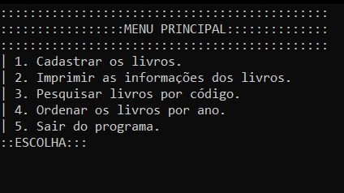

# Cadastro de Livros

Esse desafio nos ensina a como utilizar estruturas de dados (_structs_). Você também pode baixar o [executável para Windows](estrutura.exe) e testar.



## :thought_balloon: O que são Structs?

Struct ou Estrutura, é uma forma de criar um novo tipo de dados, que conterá vários tipos distintos de dados que caracterizam a estrutura.

## :slightly_smiling_face: Como criar um Struct?

```
struct <nome-do-struct> {
	/*
		Aqui virão vários tipos de dados padrões da linguagem c.
	*/
	int <nomeInt>;
	char <nomeChar>[50];
};
```

## :star2: Como declarar uma variável da nova estrutura de dados criada?

```
struct <nome-do-struct> <nome-da-variavel>;
```

### :+1: A partir da variável: Leitura e Impressão

```
// Criando o struct pessoa.
struct pessoa {
	char nome[50];
	int idade;
	char sexo;
};

// Declarando uma variável do tipo pessoa.
struct pessoa cadastro;

/*
	Leituras.
*/
gets(cadastro.nome)
scanf("%d", &cadastro.idade);
scanf("%c", &cadastro.sexo);

// Impressões.
printf("Nome: ");
puts(cadastro.nome);
printf("Idade: %d\n", cadastro.idade);
printf("Sexo: %c\n", cadastro.sexo);

```

## :bulb: Feito com

* [Dev C++](https://sourceforge.net/projects/orwelldevcpp/) - É uma IDE que utiliza os compiladores do projeto GNU para compilar programas. Suporta as linguagens de programação C e C++.

## :page_with_curl: Licença

Este desafio está sob a licença [MIT License](https://github.com/mateusaraujos/cadastro-de-livros/blob/main/LICENSE).

## :gift_heart: Gratidão

* Envie para outras pessoas :e-mail:
* Muito obrigado :wave::sunglasses:

---
Criado com :heart: por [Mateus Araújo](https://github.com/mateusaraujos) :grin: